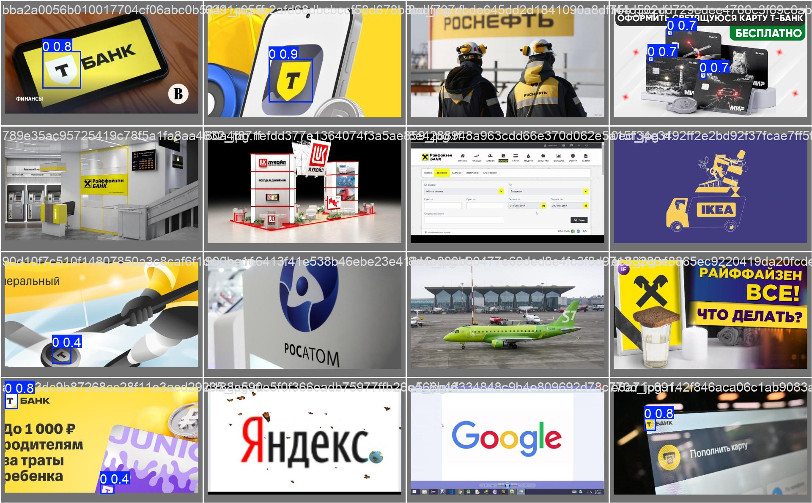
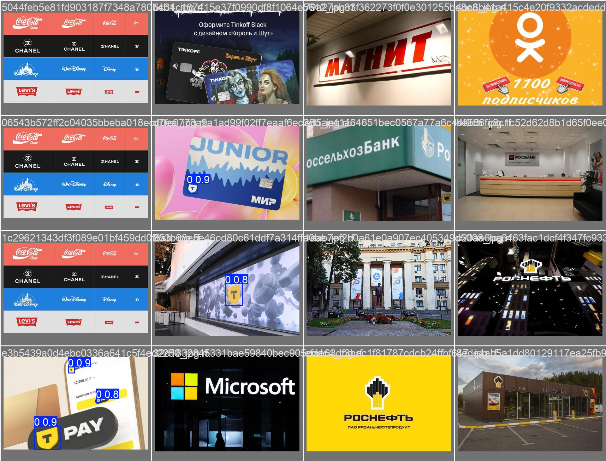

# Детектор Логотипа "Т-Банк"

Этот проект представляет собой комплексное решение для обнаружения логотипа "Т-Банк" (стилизованная буква "Т" в щите) на изображениях. Решение включает в себя модель машинного обучения (YOLOv8), REST API для инференса и Docker-контейнер для легкого развертывания.

## Установка

Для начала, клонируйте репозиторий на ваш локальный компьютер:

```bash
git clone https://github.com/gutshotexist/cvcasetbanksirius # <--- Замените на URL вашего репозитория
cd cvcasetbanksirius # <--- Замените на имя папки вашего репозитория
```

## 🚀 Быстрый старт: Запуск через Docker

Для запуска сервиса достаточно выполнить одну команду в вашем терминале. Docker должен быть установлен и запущен.

**Команда для PowerShell:**
```powershell
docker build -t tbank-detector . ; docker run --rm -d -p 8000:8000 --name tbank-api tbank-detector
```

**Команда для Command Prompt (cmd.exe) или Git Bash:**
```bash
docker build -t tbank-detector . && docker run --rm -d -p 8000:8000 --name tbank-api tbank-detector
```

После выполнения этой команды, API будет доступен по адресу `http://localhost:8000`.

### Использование API

Отправьте изображение на эндпоинт `/detect` для получения координат найденных логотипов.

```bash
# Пример запроса с использованием curl
curl -X POST -F "file=@/путь/к/вашему/изображению.jpg" http://localhost:8000/detect
```

### Остановка контейнера
```bash
docker stop tbank-api
```

---

## 📖 Подробное описание подхода

Изначальная задача осложнялась отсутствием размеченного датасета — у нас было 30,000 "сырых" изображений без какой-либо информации о расположении логотипов. Решить эту проблему "в лоб" ручной разметкой было бы слишком трудоемко. Поэтому был выбран многоэтапный подход, позволяющий итеративно улучшать качество модели и данных.

**Этап 1: Генерация синтетических данных**

Чтобы "сдвинуться с мертвой точки", мы создали искусственный датасет. Были подготовлены PNG-изображения щитов и букв "Т" на прозрачном фоне. Скрипт `scripts/generate_synthetic_data.py` комбинировал их, накладывая на случайные фоновые изображения. Ключевой особенностью этого этапа стало применение серьезных аугментаций:
-   Случайное масштабирование, вращение и позиционирование.
-   Изменение яркости, контрастности и добавление шума.
-   **Перспективные искажения**, которые имитировали вид логотипа под углом, как на реальных фотографиях.

Это позволило нам получить первоначальный, хоть и "шумный", датасет для обучения базовой модели.

**Этап 2: Обучение "учителя" и предварительная разметка**

На сгенерированных синтетических данных мы обучили первую версию модели YOLOv8. Эта модель, хоть и не была идеальной, уже обладала базовой способностью находить логотипы. Мы использовали ее в качестве "учителя" для автоматической разметки (пре-аннотации) нашего большого набора из 30,000 реальных изображений. Скрипт `scripts/pre_annotate_real_data.py` прогнал все изображения через модель и сохранил предсказанные bounding box'ы.

**Этап 3: Уточнение данных и финальное обучение**

Автоматически размеченные данные — это лишь черновик. Этот черновик был загружен в платформу для разметки (в нашем случае Roboflow, но это мог быть и Label Studio), где аннотации были вручную проверены и скорректированы мной. Этот процесс, известный как "human-in-the-loop", позволил создать высококачественный, выверенный датасет.

Именно на этом "чистом" датасете и была обучена финальная версия модели YOLOv8, которая и используется в итоговом API.

**Этап 4: Упаковка в сервис**

Финальная модель (`best.pt`) была обернута в легковесный веб-сервис с помощью FastAPI, который предоставляет REST API эндпоинт `/detect`. Весь сервис, включая модель и зависимости, был упакован в Docker-контейнер, что обеспечивает его запуск на любой машине одной командой.

## 📊 Результаты работы модели

Качество финальной модели было оценено на отложенной тестовой выборке (validation set), которая не использовалась в процессе обучения.

**Метрики качества (IoU=0.5):**
- **Precision:** 0.965
- **Recall:** 0.913
- **mAP@50:** 0.948
- **F1-Score:** 0.938

Эти метрики показывают, что модель обладает высокой точностью (большинство найденных объектов действительно логотипы) и хорошей полнотой (модель находит большинство логотипов на изображении).

**Примеры детекции:**

*Ниже представлены примеры работы модели на изображениях из валидационной выборки. Зеленым прямоугольником обведены найденные логотипы.*

| Пример 1: Детекция на группе изображений | Пример 2: Детекция на группе изображений |
| :---: | :---: |
|  |  |


## 🛠️ Продвинутое использование

### Скрипты проекта

-   `scripts/generate_synthetic_data.py`: Создание синтетического датасета.
-   `scripts/train_yolo.py`: Запуск обучения модели.
-   `scripts/pre_annotate_real_data.py`: Автоматическая разметка реальных данных.
-   `scripts/evaluate_model.py`: **Основной скрипт для валидации** и расчета метрик качества на тестовом наборе.

### Валидация

Для самостоятельного воспроизведения результатов валидации и расчета метрик:
1.  Скачайте и распакуйте архив с валидационным датасетом по ссылке ниже.
2.  Убедитесь, что после распаковки у вас есть папка `roboflow` с файлом `data.yaml` и подпапками `test`, `train`, `valid` в корне проекта.
3.  Запустите скрипт оценки:
    ```bash
    python scripts/evaluate_model.py
    ```

## 🔗 Ссылки

- **Веса Модели:** [Ссылка на скачивание best.pt](https://drive.google.com/file/d/1CtHs5nYuiIqX6SlTlr5riH2Sfm9qtJuS/view?usp=drive_link)
- **Валидационный датасет (.zip):** [Ссылка на скачивание архива](https://drive.google.com/file/d/1u_uoc9hTepGuiPJfU3a_oUtBz-U74SOV/view?usp=sharing)

---

### 💡 Дополнительные размышления и возможные улучшения

Этот раздел содержит анализ текущего решения, а также предложения по альтернативным подходам и оптимизации, которые могут быть рассмотрены для дальнейшего развития проекта.

#### 1. Альтернативные подходы к решению

Хотя выбранный подход (синтетика → пре-аннотация → fine-tuning) является надежным, существуют и другие стратегии, которые могли бы быть эффективны:

*   **Zero-Shot Detection:** Можно было бы использовать модели вроде GroundingDINO, которые способны находить объекты по текстовому описанию ("буква Т в желтом щите") без необходимости в традиционном обучении. Это могло бы стать отличным способом для быстрой генерации начальной, еще более качественной разметки для нашего "холодного старта".
*   **Использование 3D-рендеринга:** Для генерации синтетических данных можно было бы пойти дальше простого наложения 2D-ассетов. Создание 3D-модели логотипа и ее рендеринг в различных виртуальных сценах позволило бы получить фотореалистичные изображения с идеальным контролем над освещением, ракурсами и окружением.
*   **Другие архитектуры моделей:** Мы использовали YOLOv8, которая является отличным сбалансированным решением. Однако можно было бы поэкспериментировать с другими архитектурами (например, YOLO-NAS или более легковесными версиями YOLO), чтобы найти лучший компромисс между скоростью и точностью для конкретной целевой платформы.

#### 2. Анализ проблем и пути их решения

Текущее решение показывает высокие метрики, но в реальном мире всегда есть пространство для улучшений:

*   **Проблема ложных срабатываний (False Positives):** Модель может ошибочно детектировать другие, визуально похожие логотипы (например, другие буквы в щитах или знаки похожей формы).
    *   **Решение:** Собрать "датасет негативных примеров", состоящий из таких ложных объектов, и провести дополнительное обучение (fine-tuning). Это научит модель не только тому, *что* искать, но и тому, *что игнорировать*.
*   **Проблема сложных и редких случаев:** Логотип может появляться в непредсказуемых условиях — частично перекрытый, нарисованный от руки, как граффити, или сильно искаженный.
    *   **Решение:** Целенаправленно пополнять обучающий датасет такими сложными примерами, возможно, даже генерируя их с помощью более продвинутых техник аугментации (например, случайное "стирание" части логотипа).

#### 3. Анализ производительности и варианты ускорения

Сервис соответствует требованиям по времени обработки (<10 секунд), но для высоконагруженных систем есть несколько путей оптимизации:

*   **Квантизация модели:** Можно преобразовать веса модели из стандартного формата FP32 в более легковесный INT8. Это значительно уменьшает размер модели и ускоряет вычисления (особенно на CPU) при минимальной потере точности.
*   **Оптимизация с помощью TensorRT:** Для развертывания на GPU от NVIDIA (как T4, упомянутый в требованиях) можно использовать TensorRT. Это инструмент, который оптимизирует модель под конкретную архитектуру GPU, что может дать кратный прирост производительности.
*   **Пакетная обработка (Batching):** Текущий API обрабатывает изображения по одному. Если бы сервис столкнулся с большим потоком запросов, было бы эффективнее модифицировать его для приема и обработки сразу нескольких изображений (батча). Это позволяет максимально эффективно утилизировать ресурсы GPU.
